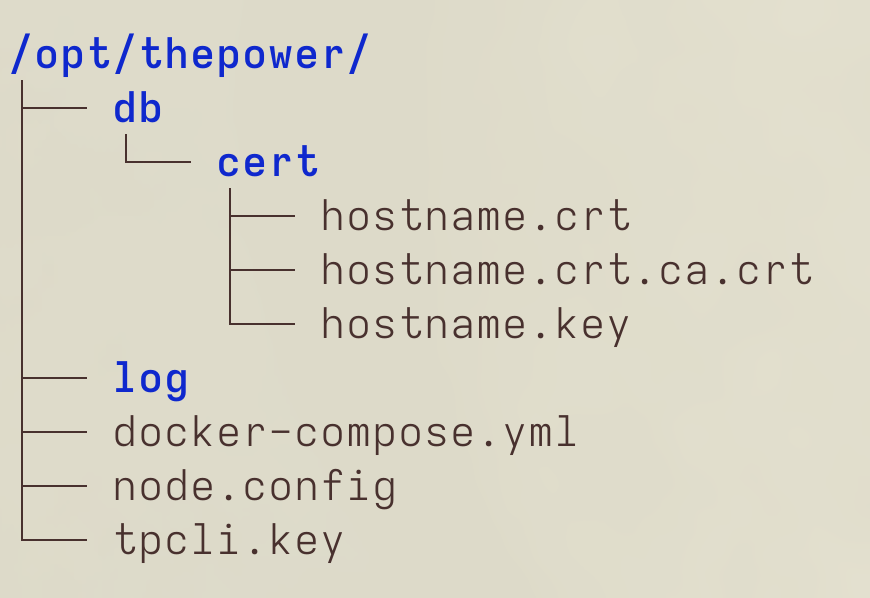

# Downloading, building, and running the node using Docker

<!-- START doctoc generated TOC please keep comment here to allow auto update -->
<!-- DON'T EDIT THIS SECTION, INSTEAD RE-RUN doctoc TO UPDATE -->
**Table of Contents**

- [Introduction](#introduction)
- [Step 1: Download the node](#step-1-download-the-node)
- [Step 2: Create directories and place the files](#step-2-create-directories-and-place-the-files)
- [Step 3: Get the certificate](#step-3-get-the-certificate)
- [Step 4: Start the node](#step-4-start-the-node)
- [Step 5 (optional): Automated updates for node with Watchtower](#step-5-optional-automated-updates-for-node-with-watchtower)
  - [Start a Watchtower container to automatically update node when a new version is available:](#start-a-watchtower-container-to-automatically-update-node-when-a-new-version-is-available)
- [How to stop the node?](#how-to-stop-the-node)

<!-- END doctoc generated TOC please keep comment here to allow auto update -->

## Introduction

We recommend you to use the simple way of building and running the node using [**`docker-compose`**](./02-download-build-run-compose.md). 

Though, if you have multiple operations running in Docker, this manual will help you to build and run the node using Docker. Follow the steps below.

## Step 1: Set up your environment

To download the node using Docker:

1. Ensure you have Docker installed on your machine.
2. If not, refer to [Docker Installation Guide](https://docs.docker.com/engine/install/).

   > **Hint:**
   >
   > If you don't use `root` account, run the following command to ensure you belong the user group `docker`:
   >
   > ```bash
   > $ groups
   > ```
   >
   > If you don't belong to the user group `docker`, run the following command:
   >
   > ```bash
   > $ sudo usermod -aG docker
   > ```

## Step 2: Create directories and place the files

> **Hint**
>
> You can create an additional directory named `thepower`, for example, and place `db` and `log` as subdirectories there.

To create directories for files:

1. Go to your working directory using the following command:

   ```bash
   cd /opt/thepower
   ```

2. Create `db` and `log` directories in your working directory (`/opt/thepower`, for instance) using the following command:

   ```bash
   mkdir {db/cert,log}
   ```

   :::info Attention

   By implementing this way of starting the node we assume that

   - `node.config`,
   - `db` and `log` directories,
   - SSL keys

   are present and stored in `/opt/thepower/`.

   The following tree describes the directories and files in them:

   

   `hostname` here is an example. Please, **replace** it with the hostname specified in your `node.config` file.

   :::

3. Go to `/opt/thepower`:

   ```bash
   cd /opt/thepower
   ```

## Step 3: Get the certificate

[Obtain the SSL certificate for your node](https://doc.thepower.io/docs/Maintain/build-and-start-a-node/ssl-certs-for-node) and place it into the `db` directory.


## Step 4: Start the node

To start the node from Docker, run:

```bash
docker run -d \
--name tpnode \
--restart unless-stopped \
--cap-add=NET_ADMIN \
--device=/dev/net/tun \
--network=host \
--mount type=bind,source=/opt/thepower/db,target=/opt/thepower/db \
--mount type=bind,source=/opt/thepower/log,target=/opt/thepower/log \
--mount type=bind,source=/opt/thepower/node.config,target=/opt/thepower/node.config \
thepowerio/tpnode
```

where:

| Command                                                                          | Description                                                                                                                                 |
|----------------------------------------------------------------------------------|---------------------------------------------------------------------------------------------------------------------------------------------|
| `docker run -d`                                                                  | This command starts Docker in the background                                                                                                |
| `--name tpnode`                                                                  | This command specifies the name (optional)                                                                                                  |
| `--restart unless-stopped\`                                                      | Similar to always, except that when the container is stopped (manually or otherwise), it is not restarted even after Docker daemon restarts |
| `--mount type=bind,source="$(pwd)"/db,target=/opt/thepower/db`                   | Path to the database. Bound to Docker. `/opt` here is mandatory, because it is the path inside the container.                               | 
| `--mount type=bind,source="$(pwd)"/log,target=/opt/thepower/log`                 | Path to log files. Bound to Docker. `/opt` here is mandatory, because it is the path inside the container.                                  |
| `--mount type=bind,source="$(pwd)"/node.config,target=/opt/thepower/node.config` | Path to your `node.config` file. Bound to Docker. `/opt` here is mandatory, because it is the path inside the container.                    |
| `--mount type=bind,source="$(pwd)"/genesis.txt,target=/opt/thepower/genesis.txt` | Path to your `genesis.txt`. Bound to Docker. `/opt` here is mandatory, because it is the path inside the container.                         |
| `--cap-add=NET_ADMIN`                                                            | Add Linux capabilities                                                                                                                      |
| `--device=/dev/net/tun`                                                          | Add a host device to the container                                                                                                          |
| `--network=host`                                                                 | Connect a container to a network                                                                                                            |
| `thepowerio/tpnode`                                                              | Path to Docker image.                                                                                                                       |

## Step 5 (optional): Automated updates for node with Watchtower

If configured, every 24 hours the [Watchtower](https://containrrr.dev/watchtower/) will check if a new version of The Power Node is available and update it if so.

:::warning

If you haven't configured automatic updates, DO NOT follow this step.

Use [this guide](./05-node-update.md) instead.

:::

### Start a Watchtower container to automatically update node when a new version is available:

```bash
docker run -d \
--name watchtower \
--restart unless-stopped \
-e WATCHTOWER_CLEANUP=true -e WATCHTOWER_TIMEOUT=60s \
-v /var/run/docker.sock:/var/run/docker.sock \
containrrr/watchtower
```

## How to stop the node?

To stop the node, run:

1. ```bash
   docker stop tpnode
   ```

2. ```bash
   docker rm tpnode
   ```

3. ```bash
   docker rmi thepowerio/tpnode
   ```