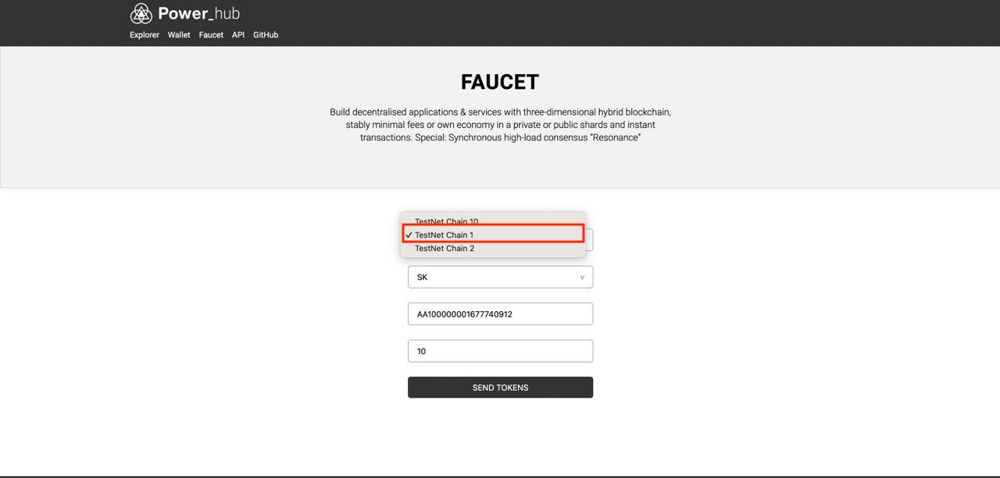
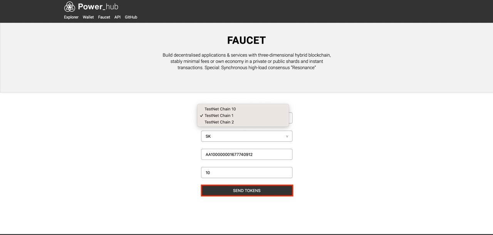

# How to Deploy Files to a Decentralized Storage (DStorage)

**Table of contents**

<!-- START doctoc -->
<!-- END doctoc -->

## Introduction


## Prerequisites

Make sure you have `npm` installed on your machine.

## Deploy the files

Follow the steps below to deploy files to a decentralized storage:

1. Install the `@thepowereco/cli` package globally using npm: 

   ```bash
   npm install -g @thepowereco/cli
   ```

2. Register an account with `tpe`: 

   ```bash
   tpe register
   ```

3. Select the `devnet` option and make a note of the provided information, as it will be needed later. Here is the example:

   ```bash
   ✔ Please, select the network: · devnet
   Loading... done
   Network: devnet
   Chain number: 1
   Account address: AA100000001677740890
   Account seed phrase: peanut shadow approve put grain outdoor hand program angry tiger cry diary
   Account wif: L2NzLJEtduehhwxT7cidd13tNDmsnZn9neoYa9wRg9W89gDcdeVu
   To replenish the balance of your account please visit: https://faucet.thepower.io
   ```

4. Go to the [**Faucet**](https://faucet.thepower.io/). 
5. Select the chain 1 option:
 
   
   
6. Copy the provided address into the information from step 3. 
7. Click **Send tokens**:

   

8. Navigate to the folder one level above the folder you want to upload. For example, if you want to upload the `/home/app` folder, navigate to the `/home` folder. 
9. Run the following command:
   
   ```bash
   tpe upload 
   ```
    
   and specify the folder you want to upload, for example `./app`. 
10. Enter the `address` and `wif` from step 3. The files will be uploaded.
11. After the files are uploaded, the location where they will be stored will be indicated.

:::info Note

To deploy a basic `create-react-app` template, modify the paths so that they start from the root domain. 

For example, replace all instances of `="/` with `="./`.

:::

Result will be like this:
https://storage11.thepower.io/AA100000001677739053/testapp2/
