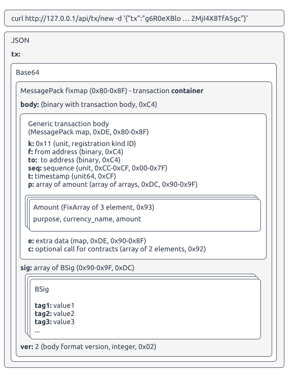

<!-- START doctoc generated TOC please keep comment here to allow auto update -->
<!-- DON'T EDIT THIS SECTION, INSTEAD RE-RUN doctoc TO UPDATE -->
**Table of Contents**  *generated with [DocToc](https://github.com/thlorenz/doctoc)*

- [Transactions](#transactions)
  - [Description of transaction API](#description-of-transaction-api)
  - [Dive into transaction format](#dive-into-transaction-format)
  - [Registration Transaction](#registration-transaction)
  - [Example of calculating the value of the key 'h'](#example-of-calculating-the-value-of-the-key-h)
  - [PoW difficulty of the registration transaction](#pow-difficulty-of-the-registration-transaction)
  - [BSig container and signature format](#bsig-container-and-signature-format)
  - [Generic transactions](#generic-transactions)

<!-- END doctoc generated TOC please keep comment here to allow auto update -->

# Transactions

<!-- start DOCTOC -->
<!-- end DOCTOC -->

Any changes you want to make in the state of the blockchain can be done using transactions. There are two main types of transactions: 

- Registration transaction;
- Generic (financial) transaction (sending token from one wallet to another);
- Calling smart contracts;
- Storing smart contracts into LStore.

All transactions are stored in Message Pack.

You can find the Message Pack specification [here](https://github.com/msgpack/msgpack/blob/master/spec.md).

There are libraries written in the most common types of programming languages.

You can download libraries from the [official site](https://msgpack.org/).

## Description of transaction API

| URL                     | Request type | Description of parameters                                                                                                                                                                                                                                             |
|-------------------------|--------------|-----------------------------------------------------------------------------------------------------------------------------------------------------------------------------------------------------------------------------------------------------------------------|
| `/api/tx/new`           | POST         | Input parameters: `{"tx": " ... packed and signed transaction ... "}`   Response: `{"txid": "153B7614F8051F79-3RGPJnQuajxy1r9zj5Jb9JUr4skE-6BC2"}` (transaction ID)                                                                                                   |
| `/api/tx/status/{txid}` | GET          | Input parameters: `{txid}` — transaction ID you've received from calling `/api/tx/new`   Response: `{"Res": null}` — the transaction was not included into the block yet (no information yet)   `{"Res": {"ok": true}}` - the transaction has included into the block |

Example of sending a transaction using `curl` (the transaction body in this example has been shortened for clarity):

```bash
~ curl http://127.0.0.1/api/tx/new -d '{"tx":"g6R0eXBlo … 2MjI4X8TfA5gc"}'

```

## Dive into transaction format

To make a new transaction, you should send a `POST` request to the server using https. Request data must be `JSON`-formatted and contain the `tx` key with base64-encoded transaction container.


The transaction container is a MessagePack fixmap (first byte: `0x80- 0x8f`). It has the following structure:

```json
{
  "body": BinaryBody (binary),
  "sig": Array (array of binary),
  "ver": 2 (unsigned integer)
}
```

The keys of this fixmap must be encoded as a `String`.

The value of the `body` is a MessagePack binary (first byte: `0xc4`) with the MessagePack-encoded transaction payload (transaction body).

The transaction body is a MessagePack map (`0xde`, `0x80-0x8f`) with one mandatory key `k`. The value of this key indicates the type of transaction and other keys depending on transaction purpose.

For the best scaling, transaction type number is unique for each type of transaction with any version of transaction version. Headers with constants should be generated by scripts from the `JSON` file supplied in distributive (`priv/tx_const.json`):

```json
{
  "purpose": {
    "0": "transfer",
    "1": "srcfee",
    "2": "dstfee",
    "3": "gas"
  },
  "kind": {
    "16": ["generic", 2],
    "17": ["register", 2],
    "18": ["deploy", 2],
    "19": ["patch", 2],
    "20": ["block", 2],
    "22": ["lstore", 2],
    "23": ["notify", 2],
    "24": ["chkey", 2]

  }
}
```

where

- "16": ["generic", 2] — a simple transaction between accounts. It is necessary for native tokens and information transmission;
- "17": ["register", 2] — account registration transaction;
- "18": ["deploy", 2] — smart contract deploy transaction;
- "19": ["patch", 2] — chain settings appliance transaction;
- "20": ["block", 2] — service-type transaction for cross-chain transactions packing;

   :::note

   This transaction is mostly internal.
   
   :::

- "22": ["lstore", 2] — LStore data update transaction;
- "23": ["notify", 2] — transaction announcing interactive actions outside the blockchain;
- "24": ["chkey", 2] — account key update transaction.

The value of the `sig` key is MessagePack array (types `0x90-0x9f` or `0xdc-0xdc`). Each array item contains signature for one key. Signature format (`BSig`) is described below. A transaction might have multiple signatures.

The value of the `ver` key is an integer, indicating a version of transaction format. The value is used to specify the body that should be used. In this release `2` (`0x02` in MessagePack) is used.

## Registration Transaction

For registration of a new wallet the `register` transaction type is used. The first byte of this type is `0xDE` or a value from a range of `0x80-0x8F`.


Here is an example of registration transaction body content (shown as `json`. Binary data represented as `base64`-encoded strings):

```json
{
  "k": 0x11,
  "t": 1530106891372,
  "nonce": "T1umkWY=",
  "h": "Y6dVG5CvZacwlbf21oybiIHh/4h+8d2EJwF7Qp/GpCA=",
  "e": {}
}
```

where:

| Value   | Description                                                                                                                                                                                                  |
|---------|--------------------------------------------------------------------------------------------------------------------------------------------------------------------------------------------------------------|
| `k`     | Transaction type (kind). This value should always be `0x11` for registration transactions (MessagePack positive `fixint` type, `0x11`)                                                                       |
| `t`     | Transaction creation timestamp (UNIX-time in milliseconds, MessagePack `uint` 64 bit type, `0xcf`)                                                                                                           |
| `nonce` | This value can be of any type and should be used to change the transaction hash (see ["PoW difficulty of the registration transaction"](#pow-difficulty-of-the-registration-transaction) section below)      |
| `h`     | This value is an `sha256`-hash of concatenated public keys sorted in an ascending manner (MessagePack binary type, `0xc4`)                                                                                   |
| `e`     | Custom additional data included into transaction (MessagePack map or fixmap type, `0xde`, `0x80-0x8f`). Custom means that the additional data is defined by user.                                            |

## Example of calculating the value of the key 'h'

In this example the following algorithm is used:

1. Take 3 arbitrary public keys (shown as `json`-array, binary data represented as a hex string):

  ```json
  [
    "025348F9AD2BDC8E394B7C3C69FDD221F8C7F95B458D56AACD677C4C9ABF8E1AE7",
    "0234326DF0BDF60DA3E6D203B73C0D0C4DEE518BD60717C3B20C0D27812C7DADEB",
    "02266C9DAA52F9BB5AD73B77A703437E27A3344F36F1D4FF0C0267C3DEA2BC91D7"
  ]
  ```

  > **Note**
  > 
  > The keys should be represented as binary data (i.e. for the string `02` you should take `0x02` byte of binary data).

2. Sort the keys. After the keys are sorted, you will get the following order:

  ```json
  [
    "02266C9DAA52F9BB5AD73B77A703437E27A3344F36F1D4FF0C0267C3DEA2BC91D7",
    "0234326DF0BDF60DA3E6D203B73C0D0C4DEE518BD60717C3B20C0D27812C7DADEB",
    "025348F9AD2BDC8E394B7C3C69FDD221F8C7F95B458D56AACD677C4C9ABF8E1AE7"
  ]
  ```

3. After concatenation step you will get the following data:

  ```bash
  02266C9DAA52F9BB5AD73B77A703437E27A3344F36F1D4FF0C0267C3DEA2BC91D70234326DF0BDF60DA3E6D203B73C0D0C4DEE518BD60717C3B20C0D27812C7DADEB025348F9AD2BDC8E394B7C3C69FDD221F8C7F95B458D56AACD677C4C9ABF8E1AE7
  ```

4. Calculate the `sha256` hash of this data. 

  > **Note** 
  > 
  > The data must be binary-formatted (i.e. string `E7` in the example should be byte `0xE7` of binary data). You will calculate the hash of binary data, **NOT** a string of ASCII symbols.

  For the data in this example the `sha256` hash is:
  
  ```bash
  CB32960606B0E3846D763B8DA8FE5EF7379D89A227C2B6DBDA499F4ECEA0B071
  ```

## PoW difficulty of the registration transaction

To prevent mass registration of wallets, a PoW calculation for every registration transaction is required. In this case, the PoW means you should change the transaction data to get a `sha512` hash which meets special requirements. These requirements are usually called **difficulty**.

You can get the current difficulty of the shard by calling the `/api/settings` API. By this API call you'll get a JSON object. The value of the key `settings.current.register.diff` is the difficulty of the shard.

For example, if difficulty is 16 you should get a `sha512` hash of the transaction with 16 leading bits of 0 (i.e. two leading bytes should be equal to 0). You should change the `nonce` key value of the registration transaction to get a hash with 16 leading 0 bits.

> **Note**
> 
> The transaction body hash can't be put into transaction itself. To check, if transaction meets the difficulty requirements, server recalculates the `sha512` hash of the transaction body. You should change the `nonce` key value of the registration transaction to get the transaction data with sha512 hash containing 'difficulty' of leading bits equal to 0.

Let's take the following transaction body (shown as `JSON`, binary value of the `h` key shown as hex-encoded string):

```json
{
  "k": 17,
  "t": 1541067579755,
  "nonce": 0,
  "h": "957216f45873f7d09466610b887f1634359b000820bc91119e0efea70d2de64d"
}
```

Here is the hex dump of the MessagePack-encoded transaction body:

```bash
84a16b11a174cf00000166cec9216ba56e6f6e636500a168c420957216f45873f7d09466610b887f1634359b000820bc91119e0efea70d2de64d
```

The sha512 hash of this transaction body is:

```bash
3890c8e314282271d4050d049adf70722210e4147551b76edfc74e2fb9977bbf
5ef41f4cc83d38144adc6bc52c93d3d1fb30473b043bf2f3b91c05dfcb6835a0
```

The first byte of the hash is `0x38` or `00111000` in binary format. This means the difficulty of preparation for this transaction body is `2` (hash has 2 leading 0 bits).

In case we changed the value of the `nonce` key the hash of the transaction body would change.

Here is the same transaction, but the value of the `nonce` key is changed to 210 (shown as `JSON`, binary value of the `h` key shown as hex-encoded string):

```json
{
  "k": 17,
  "t": 1541067579755,
  "nonce": 210,
  "h": "957216f45873f7d09466610b887f1634359b000820bc91119e0efea70d2de64d"
}
```

Here is the hex dump of the MessagePack-encoded transaction body:

```bash
84a16b11a174cf00000166cec9216ba56e6f6e6365ccd2a168c420957216f458
73f7d09466610b887f1634359b000820bc91119e0efea70d2de64d
```

The sha512 hash of this transaction body is:

```bash
0014e384d970d49feb87c476720f52942dc09ee086a57e2505a32a00b1747135
1872ea751e6b323c5d319a0fb5eb2f28c1fb2f8cad4e7d1b6ff8debbc52eb78f
```

The binary representation of the first two bytes of that hash is:

```bash
00000000  00010100
  0x00      0x14
```

This hash has 11 leading 0 bits, so the difficulty of preparation for this transaction body is 11.

## BSig container and signature format

The BSig container is a binary data of TLV format (Tag - Length - Value).


Each signature may contain additional data signed with main payload (body, data to be signed).

Here are the predefined fields:

| Name           | Length | Tagl | Type |
|---------------|-------|------|-----|
| `timestamp`     | 8      | `1`    | `uint64` |
| `pubkey`        | vary   | `2`    | `binary` |
| `createduration` | 8      | `3`    | `uint64` |
| `OTHER`         | vary   | `240`  | `binary` |
| `purpose`       | vary   | `254`  | `string` |
| `signature`      | vary   | `255`  | `binary` |

The public key is mandatory. Every BSig should contain the public key tag.

Let's look at the signing procedure by an example.

Let's assume you have the private key `0102030405060708090001020304050607080900010203040506070809000102`, and you want to sign the 'Hello, world!' string.

1. Calculate a public key. For this private key it will be: 

`02B1912FABA80FCECD2A64C574FEFE422C61106001EC588AF1BD9D7548B81064CB`

2. Put the current timestamp into the container.

  Here is the binary data you have at this step:
  
  ```bash
  02 21 02B1912FABA80FCECD2A64C574FEFE422C61106001EC588AF1BD9D7548B81064CB
  01 08 00000164B250D800
  ```

  ```bash
  tag 0x02 (public key), length of data 0x21, public key data
  tag 0x01 (timestamp), length of data 0x08, current unixtime as milliseconds in unsigned int 64 format
  ```

3. The next step is appending of data for signing to binary from the previous step:

  ```bash
  # tag 0x02 (public key), length of data 0x21, public key data
  02 21 02B1912FABA80FCECD2A64C574FEFE422C61106001EC588AF1BD9D7548B81064CB
  
  # tag 0x01 (timestamp), length of data 0x08, current unixtime as milliseconds in unsigned int 64 format
  01 08 00000164B250D800
  
  # 'Hello, world!' string added to the end of BSig container
  48656C6C6F2C20776F726C6421
  ```

  Here is the resulting binary for signing (shown as hexdump):
  
  ```bash
  022102B1912FABA80FCECD2A64C574FEFE422C61106001EC588AF1BD9D
  7548B81064CB010800000164B250D80048656C6C6F2C20776F726C6421
  ```

  The sha256 hash of this whole binary will be `60C3B88A5F32816F574C8FABFB45A35338A20D7C1678F20DABDBBD7F94568F15`.

4. Calculate the hash signature from the previous step. The signature is:

  ```bash
  304402205250D827749F285CE174137EC88B394092E43B9E6C6774045EE5E6ED502322520
  2204D1628F019E57BF19C1A0FE37193355A059F22CF8203D85E112FF3B4873D46FE
  ```
  > **Note**
  > 
  > You always work with binary data. You should sign the hash binary data (NOT it's ASCII characters representation).

5. Remove the payload you appended to container and prepend the container with the signature tag:

  ```bash
  FF 46 304402205250D827749F285CE174137EC88B394092E43B9E6C6774045EE5E6ED5023225202204D1628F019E57BF19C1A0FE37193355A059F22CF8203D85E112FF3B4873D46FE
  02 21 02B1912FABA80FCECD2A64C574FEFE422C61106001EC588AF1BD9D7548B81064CB
  01 08 00000164B250D800
  ```

  ```bash
  tag 0xFF (signature), length of data 0x46, binary data of signature (NOT it's ASCII)
  tag 0x02 (public key), length of data 0x21, binary data of public key (NOT it's ASCII)
  tag 0x01 (timestamp), length of data 0x08, current unixtime as microseconds in unsigned int 64 format
  ```

## Generic transactions

Token transfer and/or smart contract call:



Token transfer and smart contract calling transactions must contain the following mandatory keys:

| Key | Meaning   | Descripton                                                                                        |
|-----|-----------|---------------------------------------------------------------------------------------------------|
| f   | from      | Source address, must be 8 byte binary (`0xc4` MessagePack type)                                   |
| to  | to        | Destination address, must be 8 byte binary (`0xc4` MessagePack type)                              |
| s   | seq       | Transaction (tx) nonce, must be positive integer (`0x00` - `0x7f` or `0xcc` - `0xcf`)             |
| t   | timestamp | Transaction (tx) unix-time in milliseconds, positive integer (`0x00` - `0x7f` or `0xcc` - `0xcf`) |
| p   | payload   | Array of amounts (see below, `0xdc` or `0x90` - `0x9f`)                                           |

Optional keys:

| Key | Meaning   | Description                                                                                                                                                                                                                                                                                                                              |
|-----|-----------|------------------------------------------------------------------------------------------------------------------------------------------------------------------------------------------------------------------------------------------------------------------------------------------------------------------------------------------|
| c   | call      | This key is needed for transaction intended to call smart contract method. This attribute should contain 2 element array (`0x92`), the first element is the method name (`String`), the second is an array of arguments (arbitrary types, but tx call with incorrect types will be dropped by a smart contract)                          |
| e   | extradata | Map with arbitrary extra data that might be used by a smart contract or a wallet application. The `code` key is reserved for `deploy` method and should not be used for any other purposes (types `0x80` - `0x8f` or `0xde` - `0xdf`). It is recommended to use the key with the name `msg` to place some text or comment to transaction |

Attribute `p` (payload) is an array of 3 element arrays (`0x93`).

Here is an example of payload (shown as `JSON`):

```json
[
  [purpose, "currency name", amount],
  [purpose, "currency name", amount],
  [0x00, "SK", 10],
  [0x01, "SK", 3]
]
```

Payload has the following elements:

1. Purpose (positive fixint, `0x00` - `0x7f`) from a `JSON` shown before.

2. Currency name (binary, `0xc4`). Even if the currency name contains only ASCII characters with codes 32-126 you still **MUST** use the binary type.

3. Amount (integer, `0x00` - `0x7f`, `0xcc` - `0xcf`). This field MUST be only the integer type. You **CAN NOT** use the float type or any other type.

  In case this array contains more than 3 elements, all extra elements should be ignored (for example, it might be an array generated by software with a newer version of the protocol).

  Clients **MUST NOT** add extra fields to payload array when creating a transaction, because it might break compatibility with new versions.

Here is an example of the whole transaction (218 bytes, shown as `base64`-encoded binary):

```bash
g6Rib2R5xFCHoWsQoWbECIAAIAACAAADonRvxAiAACAAAgAABaFzzwAFeYouTBkw
oXTPAAABZstPb6ShcJKTAKJTSxGTAaNGRUUDoWWBo21zZ6VoZWxsb6NzaWeRxHb/
RzBFAiBSpsU9BM3tcsK+7lAFUdgOiHsZlvw90gwM9mKIMtMVvQIhAM4K0Qn6jgm8
2czyso2LupaosplS6eJ7Su2jpxMujOj7AiECsZEvq6gPzs0qZMV0/v5CLGEQYAHs
WIrxvZ11SLgQZMsBCAAAAWbLT2+ko3ZlcgI=
```

The same transaction shown as hex dump:

```bash
# 83 = fixmap of 3 elements
83

# body
a4 626f6479 c45087a16b10a166c4088000200002000003a2746fc408800020
            0002000005a173cf0005798a2e4c1930a174cf00000166cb4f6f
            a4a170929300a2534b119301a346454503a16581a36d7367a568
            656c6c6f

# sig
a3 736967   91c476ff473045022052a6c53d04cded72c2beee500551d80e88
            7b1996fc3dd20c0cf6628832d315bd022100ce0ad109fa8e09bc
            d9ccf2b28d8bba96a8b29952e9e27b4aeda3a7132e8ce8fb0221
            02b1912faba80fcecd2a64c574fefe422c61106001ec588af1bd
            9d7548b81064cb010800000166cb4f6fa4a

# ver
37 66572    02
```

The transaction container is a MessagePack fixmap (shown as JSON-like format, binary data shown as hex dump):

```bash
{
  "body":
      c45087a16b10a166c4088000200002000003a2746fc4088000200002000005a1
      73cf0005798a2e4c1930a174cf00000166cb4f6fa4a170929300a2534b119301
      a346454503a16581a36d7367a568656c6c6f,

  "sig":
      ff473045022052a6c53d04cded72c2beee500551d80e887b1996fc3dd20c0cf6
      628832d315bd022100ce0ad109fa8e09bcd9ccf2b28d8bba96a8b29952e9e27b
      4aeda3a7132e8ce8fb022102b1912faba80fcecd2a64c574fefe422c61106001
      ec588af1bd9d7548b81064cb010800000166cb4f6fa4,

  "ver": 2
}
```

Here is the transaction body with comments:

```bash
c450   # binary, length 0x50 bytes
87     # fixmap of 7 elements

# a1 = fixstr of 1 symbol, 6b = 'k' (this is the map key name), the value is 0x10
a16b10

# a1 = fixstr of 1 symbol, 66 = 'f', c408 = binary of 8 bytes,
# the value is 8000200002000003 (encoded AA010000003355443516 wallet address)
a166c4088000200002000003

# a2 = fixstr of 2 symbols, 746f = 'to', c408 = binary of 8 bytes,
# the value is 8000200002000005 (encoded AA010000003355443737 wallet address)
a2746fc4088000200002000005

# a1 = fixstr of 1 symbol, 73 = 's', cf = uint64,
# 0005798a2e4c1930 = 1541009272740144 = 2018-10-31 18:07:52.740144
a173cf0005798a2e4c1930

# a1 = fixstr of 1 symbol, 74 = 't', cf = uint64,
# 00000166cb4f6fa4 = 1541009272740 = 2018-10-31 18:07:52.740
a174cf00000166cb4f6fa4

# a1 = fixstr of 1 symbol, 70 = 'p', 92 = fixarray of 2 elements
a17092

# 93 = fixarray of 3 elements, 00 = 0 (transfer), a2 = fixstr of 2 symbols,
# 534b = 'SK', 11 = 0x11 = 17 (amount)
9300a2534b11

# 93 = fixarray of 3 elements, 01 = 1 (srcfee), a3 = fixstr of 3 symbols,
# 464545 = 'FEE', 03 = 3 (amount)
9301a346454503

# a1 = fixstr of 1 symbol, 65 = 'e', 81 = fixmap of 1 element
a16581

# a3 = fixstr of 3 symbols, 6d7367 = 'msg'
a36d7367

# a5 = fixstr of 5 symbols, 68656c6c6f = 'hello'
a568656c6c6f
```

Here is the `sig` value with comments:

```bash
# 91 = fixarray of 1 element
91

# c476 = binary of 0x76 bytes
c476

# below this point goes bsig

# ff47 = signature, length 0x47 bytes ( = 71 in decimal)
ff47

# 71 bytes of signature
3045022052a6c53d04cded72c2beee500551d80e887b1996fc3dd20c0cf6628
832d315bd022100ce0ad109fa8e09bcd9ccf2b28d8bba96a8b29952e9e27b4a
eda3a7132e8ce8fb

# 0221 = public key, length 0x21 bytes ( = 33 in decimal)
0221

# 33 bytes of public key
02b1912faba80fcecd2a64c574fefe422c61106001ec588af1bd9d7548b81064cb

# 0108 = timestamp, length 8 bytes,
# 00000166cb4f6fa4 = 1541009272740 = 2018-10-31 18:07:52.740
010800000166cb4f6fa4
```
