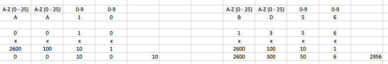

# Addresses

<!-- START doctoc generated TOC please keep comment here to allow auto update -->
<!-- DON'T EDIT THIS SECTION, INSTEAD RE-RUN doctoc TO UPDATE -->

- [Introduction](#introduction)
- [Address structure in textual and binary representation](#address-structure-in-textual-and-binary-representation)
  - [Address structure in binary representation](#address-structure-in-binary-representation)
  - [Address structure in textual representation](#address-structure-in-textual-representation)
- [Conversion of public and private addresses](#conversion-of-public-and-private-addresses)
  - [Public address conversion](#public-address-conversion)
  - [Private address conversion](#private-address-conversion)

<!-- END doctoc generated TOC please keep comment here to allow auto update -->

## Introduction

Currently, addresses can be represented in two following formats:

1. [Human-readable representation. This representation is created to be read by a human. It will be called **textual representation** or **textual format** further herein](#address-structure-in-textual-representation)
2. [Machine-readable representation. This representation is created to be read by a machine and represents addresses inside transactions or the blockchain itself. It will be called **binary representation** or **binary format** further herein.](#address-structure-in-binary-representation)

> **Note**
>
> It is recommended to use the text representation of the address wherever a user is supposed to work with addresses.

**Example of a textually represented address:**

```bash
AA100000001677722412
```

**Example of an address represented in binary HEX format:**

```bash
800140000100000B
```

The addresses can be:

- Public — these addresses are available globally. It facilitates performing transactions in other chains.
- Private addresses — these addresses can be used only within a private chain.

## Address structure in textual and binary representation

### Address structure in binary representation

The address consists of 8 bytes of binary data. While encoding the address or in various transformations associated with it, the location of the BigEndian bits is used, which means that the most significant bits of the address are on the left, and the least significant bits of the address are on the right. In binary format, the bits have the following values:

```bash
100GGGGG GGGGGGGG GGGBBBBB BBBBBBBB BBBBBBBB AAAAAAAA AAAAAAAA AAAAAAAA
```

or:

```bash
101BBBBB BBBBBBBB BBBBBBBB BBBBBBBB BBBBBBBB AAAAAAAA AAAAAAAA AAAAAAAA
```

The three most significant bits indicate the type of the address:

- 100 - public address;
- 101 - private.

Any other value in the three most significant bits makes the address invalid. The remaining bits have the following meaning:

- **G** — the public address group ID.
- **B** — the address block ID.
- **A** — the wallet ID inside the block.

### Address structure in textual representation

In the textual format, private and public addresses have different lengths in characters:

- 18 characters — private address (private address example: 00000000FE00007DF0);
- 20 characters — public address (public address example: AA100000001677722412).

It's recommended to break the address into batches converted into the binary format according to different rules.

The primary purpose of ID being split into two batches is to assign address blocks to chains. In this case, each chain will be able to assign addresses to users independently from other chains.

The public address consists of the following batches:

```bash
AADDLLLLLLLLLLLLLLCC
```

where:

**A** — letters of the Latin alphabet;
**D** — digits, AADD together encode a group ID;
**L** — digits, in this batch, the address IDs block and the wallet block IDs are coded;
**C** — the lowest part of the address checksum (the last two digits of the checksum written in decimal form).

Let's look at how each batch is coded. As already mentioned, the first four characters of the address in the text representation encode the group ID, but the letters and digits are transformed according to different rules:

- The letters (the first two characters) represent a number in the 26-digit numbering system (A-0, B-1, C-2, ..., Z-25).
- Numbers (the two symbols following the letters) are considered in the decimal notation.

## Conversion of public and private addresses

The conversion of private and public addresses is performed differently. To choose the proper algorithm for the conversion, define the type of address you are working with.

### Public address conversion

Here is an example of calculating the group number for different addresses (`AA10` — group number `0010d` in decimal notation or `1010b` in binary notation, `BD56` — group number `295610` or `1011100011002`):



The following 14 characters encode the address block and wallet ID in this block. These characters should be considered as a number in the decimal numbering system. This number needs to be converted to the binary system.

Here is the calculation example:

```bash
AA100000001677722412

                   decimal       bin
AA10            =  0010d         =  1010b
00000016777224  =  16777224   =  1000000000000000000001000


100 00000   00000001   010 00000   00000000   00000001   00000000   00000000   00001000
  0x80        0x01        0x40       0x00       0x01       0x00       0x00       0x08
```

The remaining 2 characters are the checksum calculated by the CRC32 algorithm from the entire address.

**Example of calculating CRC32 from a PHP address**

In this case, the address checksum in the decimal notation will be `693220412`. In this example the same checksum is presented in the hexadecimal notation for clarity:

```php
% php crc_example.php
crc32: 2271368432 [dec], 0x876254f0 [hex]
```

```php
% cat crc_example.php
<?php
$addr = hex2bin("A0000000FE00007D");
$crc32 = crc32($addr);

printf("crc32: $d [dec], 0x%x  [hex]\n\n", $crc32, $crc32);
?>
```

The last two digits of the checksum written in the decimal notation will be 12. These characters are written in the address as a checksum: if the checksum converges, the address is converted correctly.

### Private address conversion

In the case of private addresses, the conversion is much simpler. The following example can schematically express the textual representation of a private address:

```bash
HHHHHHHHHHHHHHHHCC
```

where:

- **С** — the checksum (in hexadecimal format (characters 0-9, A-F))

- **H** — hexadecimal digits (characters 0-9, A-F)

To get binary representation of the private address, you need to discard the checksum's last two symbols (marked with the letter C in the example), and the remaining symbols (marked with the letter H in the example) are converted as a hexadecimal number. The top three bits of this number need to be presented as 101 — the indicator, showing that the **address is private**.

**Calculation example:**

```bash
Address: 00000000FE00007DF0
```

where:

- `00000000FE00007D` — address itself;
- F0 — checksum. It's needed to change high bits of the address to 101 and convert it to hexadecimal:

   ```bash
   A0000000FE00007D
   ```

**Example of calculating a checksum in PHP:**

```php
% php crc_example.php
crc32: 693220412 [dec], 0x2951b43c [hex]

% cat crc_example.php
<?php
$addr = hex2bin("8001400001000008");
$crc32 = crc32($addr);

printf("crc32: %d [dec], 0x%x [hex]\n\n", $crc32, $crc32);
?>
```

The two last symbols of the checksum in the hexadecimal notation of `F0` are the same as written for the address in the text representation from the example above.
