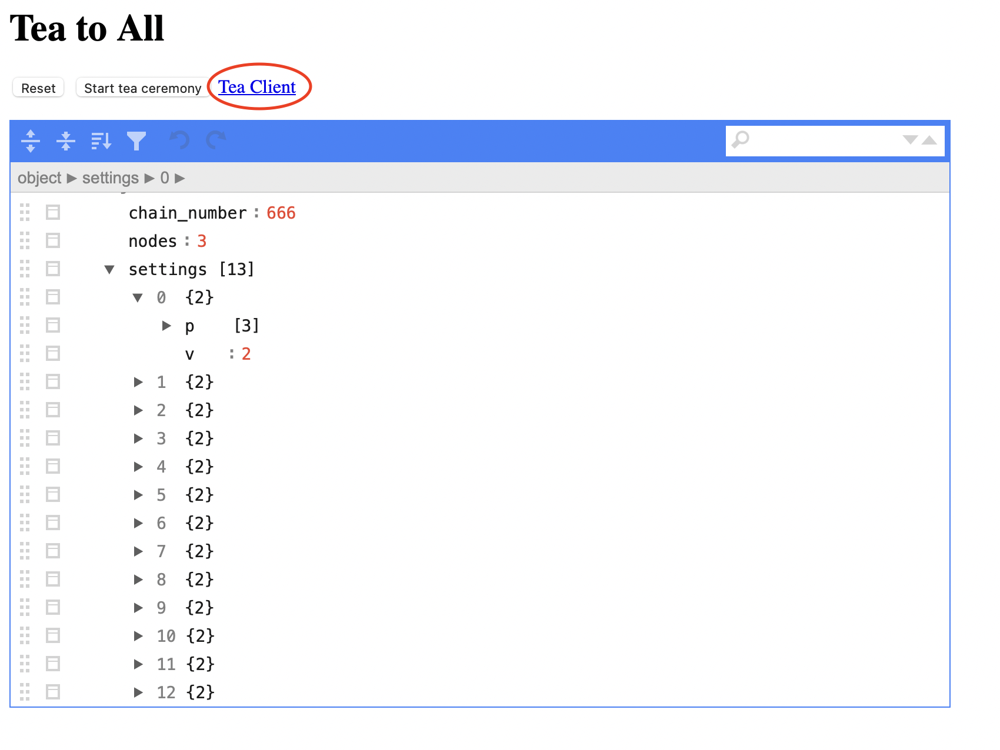

# How to start a client?

**Table of Contents**

   - [Introduction](#introduction)
   - [Set up your environment](#set-up-your-environment)
   - [Get the Tea Ceremony client](#get-the-tea-ceremony-client)
   - [Start the Tea Ceremony client](#start-the-tea-ceremony-client)
   - [After the client is started](#after-the-client-is-started)
   - [After the successful ceremony](#after-the-successful-ceremony)

## Introduction

This guide will help you get and start the Tea Ceremony client.

## Set up your environment

> **Note**
>
> To start the Tea ceremony client, ensure you have Erlang installed on your machine.

If you don't have Erlang installed on your machine, follow the steps below:

1.  Download the `kerl` script:

    ```bash
    curl -O [https://raw.githubusercontent.com/kerl/kerl/master/kerl](https://raw.githubusercontent.com/kerl/kerl/master/kerl)
    ```
    
    > **Note**
    >
    > If you already have Erlang installed on your machine, we strongly recommend deleting it before the new installation, using the following command:
    >
    > ```bash
    > apt purge erlang*
    > ```

2. Change script mode to executable by using the following command:

    ```bash
    chmod a+x kerl
    ```
   
3. Create a new directory in `/opt`. You can choose any name for this directory. Noteworthy is that the name should be descriptive for you:

   ```bash
   mkdir erlang
   ```

4. Update the list of Erlang releases using the following command:

```bash
./kerl update releases
```

5. Build the release 22.3.4.25 using the following command:

```bash
./kerl build 22.3.4.25
```

> **Important**
>
> You need to install Erlang ver. 22.3.4.25. Other versions may not work correctly.

After installation is complete, you will see the following message in the console:

```text
Erlang/OTP 22.3.4.25 (22.3.4.25) has been successfully built
```

6. Install Erlang using the following command:

```bash
./kerl install 22.3.4.25 /opt/erlang
```

7. Run the following command to activate the Erlang installation:

```bash
source /opt/erlang/activate
```

## Get the Tea Ceremony client

To get the Tea Ceremony client:

1.  Go to [https://tea.thepower.io](https://tea.thepower.io).
2.  Click on the **Tea Client** button to download the Tea Ceremony client.

    

## Start the Tea Ceremony client

To start the client, open the Erlang console and run the following command:

```erlang
./teaclient.uu 52E616B1B48C
```

where

- `teaclient.uu` — Tea Ceremony client,
- `52E616B1B48C` — Tea Ceremony Token, you've got from the Tea Ceremony administrators.

After you have started the client, you can watch the Tea Ceremony process.

> **Note**
>
> If the client is started without options, you will see a short reference on the command and options.

## After the client is started

After the client is started, all the nodes in the chain sign the `genesis.txt` with their private keys. After that, the ceremony ends.

The Tea Ceremony has three steps. The client shows how many nodes have participated in each step.

> **Note**
>
> You can turn the client off and turn it on again if you need to. It will slow down the Tea Ceremony, but it will not be disrupted.

## After the successful ceremony

After the successful tea ceremony, the following files are created in the working directory:

- `genesis.txt` signed with the private keys of all the nodes in the chain,
- `node.config` containing the node private key.

After that, you can start the node from the Docker image or source code using our guides.