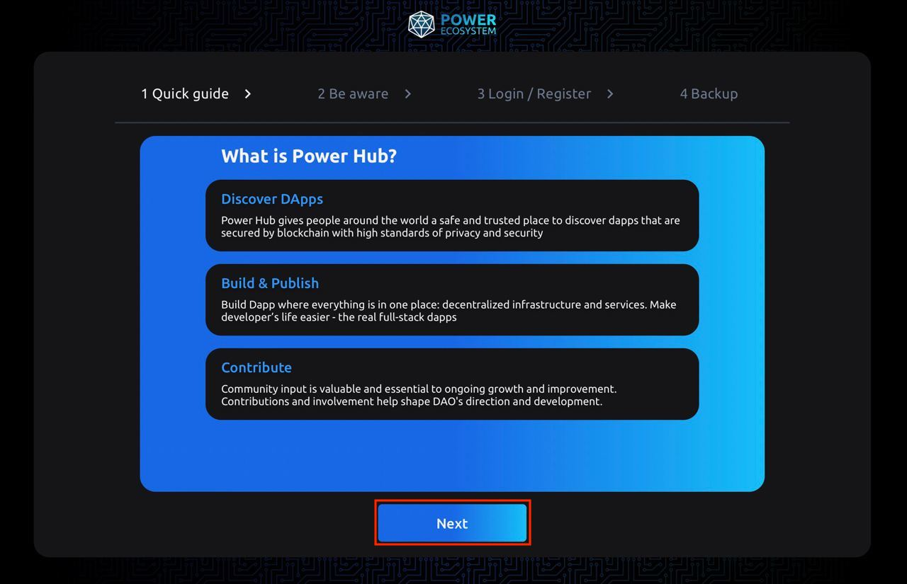
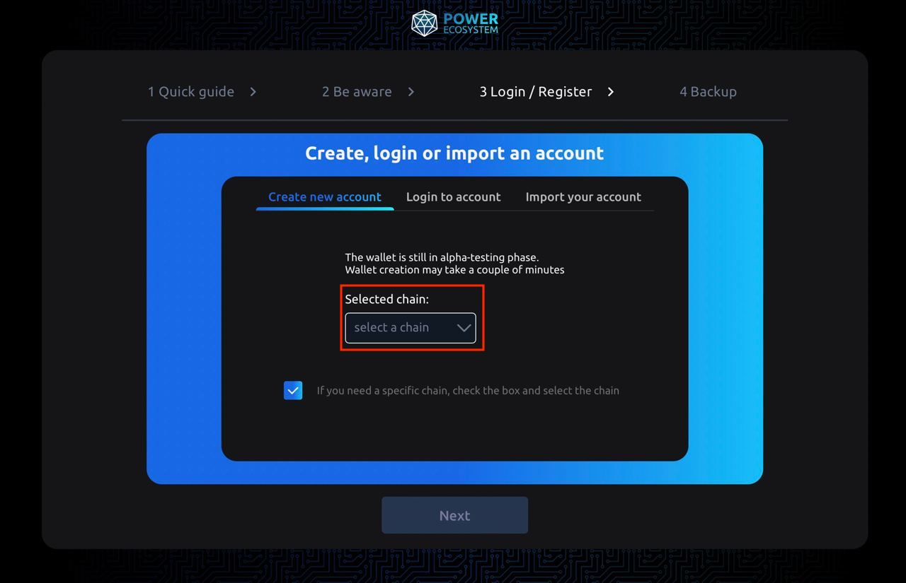
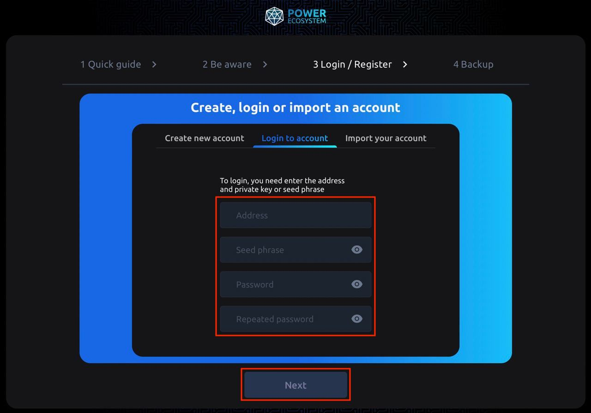

# Creating a wallet on PowerHub

:::caution Attention

This section is under development at the moment.

:::

To create a wallet on PowerHub:

1. Go to [PowerHub website](https://hub.thepower.io/signup).
2. Click **Join Web3** button:

   

3. Carefully read the quick guide and click **Next**:

   

4. Carefully read the precautions and click **Next**:

   

5. On the next step you have three following options:

   1. **Create new account**.
   2. **Log into existing account**.
   3. **Import your account**.

   **Create new account**

   To create new account:

   1. Tick the checkbox **If you need a specific chain, check the box and select the chain**. Otherwise, the wallet will be created in a random chain:
   
      

   2. Select the chain you need from the dropdown list:

      

   3. Read the precautions and set a seed phrase. Use can either use the provided seed phrase or set a custom one:

      

   4. Set password and click **Next**:

      

   5. Export your wallet data so that you may recover your wallet later. You can skip this step, but in this case you won't be able to restore your wallet:

      

   6. By clicking **Export** button you'll see the following window:

      

      Set the password and click **Next**.

      The `power_wallet.pem` file will be downloaded. You can recover your wallet using this file, password, and seed phrase later in case of emergency.

   **Log into existing account**

   To log into an existing account enter address, seed phrase, and password, and click **Next**:

   

   **Import your account**

   To import your account, upload `power_vallet.pem` file from your computer:

   